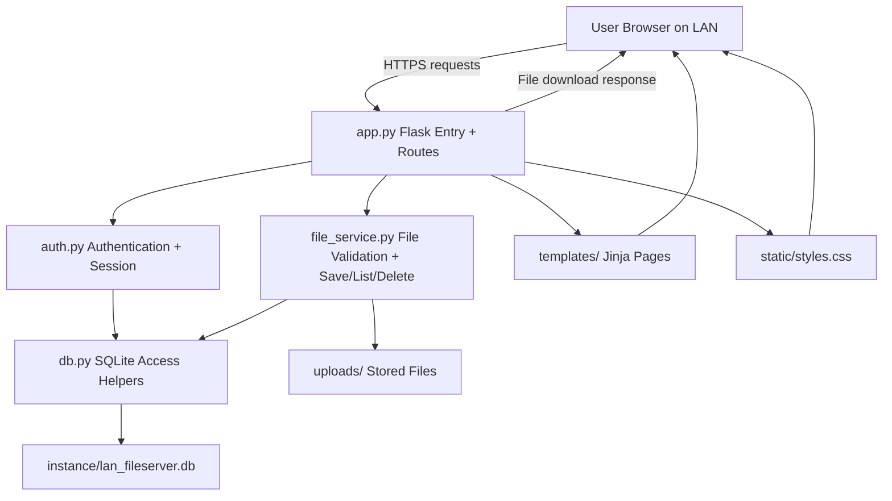

# LAN File Server

A modular Flask + SQLite LAN file-sharing web app with user authentication, file ownership controls, and HTTPS support.

## What this project does

LAN File Server is a small web application for sharing files inside a local network (LAN). Users can create an account, sign in, upload files (up to 50 MB), download shared files, and delete only the files they uploaded. The app is built with Flask and SQLite, with a modular structure that separates authentication, database access, and file handling. It runs with HTTPS enabled by default (development certificate) and provides browser-based pages for landing, login/register, and file management. The goal is to keep deployment simple while still enforcing basic security and ownership rules.

## Architecture



## Features

- Landing, sign-up, sign-in, and sign-out flows
- Session-based authentication with password hashing
- Upload, download, list, and delete files
- Owner-only delete permission
- 50 MB upload limit
- Allowed file formats:
  - `.csv, .gif, .jpeg, .jpg, .json, .log, .pcap, .pcapng, .pdf, .png, .txt`
- HTTPS enabled by default (self-signed cert in development)

## Tech Stack

- Backend: Flask
- Database: SQLite
- Frontend: Jinja2 templates + CSS
- Security: Werkzeug password hashing + HTTPS runtime options

## Prerequisites

- Python 3.10+
- `pip`

## Quick Start

```bash
python3 -m venv .venv
source .venv/bin/activate
pip install -r requirements.txt
python app.py
```

Or use the one-command bootstrap script (creates the venv, installs
dependencies, generates a persistent `SECRET_KEY`, prints the LAN URL,
and starts the server):

```bash
./scripts/start.sh
```

Default run:

- Host: `0.0.0.0`
- Port: `8443`
- Protocol: HTTPS

Open:

- Local: `https://127.0.0.1:8443`
- LAN: `https://<your-lan-ip>:8443`

Note: browser warning is expected with self-signed development certificates.

## Runtime Configuration

Environment variables:

- `HOST` (default: `0.0.0.0`)
- `PORT` (default: `8443`)
- `FLASK_DEBUG` (default: `1`)
- `ENABLE_HTTPS` (default: `1`)
- `SSL_CERT_FILE` (optional; requires `SSL_KEY_FILE`)
- `SSL_KEY_FILE` (optional; requires `SSL_CERT_FILE`)

### Use your own certificate

```bash
SSL_CERT_FILE=/path/to/cert.pem SSL_KEY_FILE=/path/to/key.pem PORT=8443 python app.py
```

### HTTP-only mode (dev/troubleshooting)

```bash
ENABLE_HTTPS=0 PORT=5001 python app.py
```

## Upload Rules

- Max size: 50 MB per request
- File extension must be in the allowed list above
- Invalid upload format triggers a bottom-right toast notification in the UI

## Database

SQLite database path:

- `instance/lan_fileserver.db`

Tables:

- `users`
- `files`

Initialized automatically on app startup.

## Common Issues

### Port already in use

Run on a different port:

```bash
PORT=8444 python app.py
```

### Seeing `400 Bad request version` with binary bytes in logs

This usually means HTTPS traffic was sent to an HTTP server. Ensure protocol matches your run mode:

- HTTPS mode -> use `https://...`
- HTTP mode -> use `http://...`

## Development Notes

- Runtime artifacts are excluded via `.gitignore` (`.venv`, DB, uploads, caches)
- Keep modules focused by responsibility:
  - routing in `app.py`
  - auth in `auth.py`
  - file operations in `file_service.py`
  - DB access in `db.py`
- Reusable contributor scaffold is included:
  - `docs/GETTING_STARTED.md`
  - `docs/DESIGN_SYSTEM.md`
  - `scripts/start.sh`
  - `tests/README.md`

## License

MIT (see `LICENSE`).
