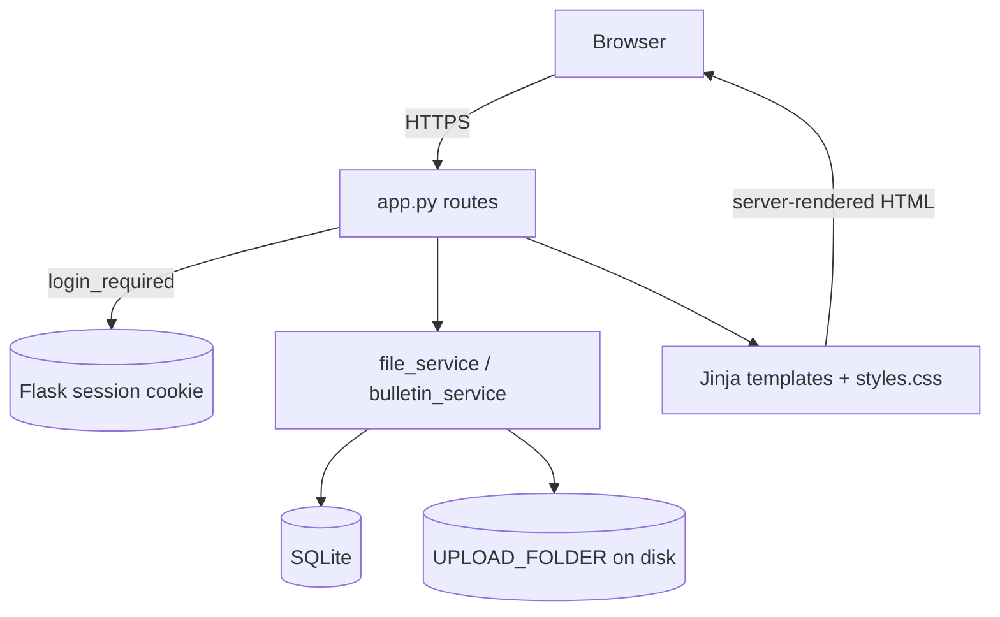

# Architecture

Reference record of the LAN File Server, written to support **integrating it into
[DUT_browser](https://github.com/reviealnow/DUT_browser)**. Part 1 documents this repo
as-is; Part 2 analyses the integration.

---

## Part 1 — LAN File Server (this repo)

### 1.1 Stack
- **Backend:** Flask (server-rendered Jinja templates), single process.
- **Persistence:** SQLite via the stdlib `sqlite3` module.
- **Auth/session:** Flask server-side session cookie (signed with `SECRET_KEY`).
- **Transport:** HTTPS — adhoc self-signed cert by default, or real certs via env.
- **Dependencies:** `Flask`, `cryptography` (only). No ORM, no JS framework.

### 1.2 Module map
| File | Responsibility |
|---|---|
| `app.py` | App factory `create_app()`, all routes, error handlers, chart/activity helpers, `__main__` HTTPS launcher. |
| `config.py` | `Config` class — `SECRET_KEY` (env + random fallback), `DATABASE`, `UPLOAD_FOLDER`, `MAX_CONTENT_LENGTH` (50 MB), `ALLOWED_EXTENSIONS`. |
| `db.py` | SQLite connection on Flask `g`, `init_db()` (DDL for 4 tables), `query_one` / `query_all` / `execute`. |
| `auth.py` | `auth_bp` blueprint: `/register`, `/login`, `/logout`; werkzeug password hashing; `login_required` decorator. |
| `file_service.py` | Upload (unique-name + `secure_filename`), list, fetch, owner-gated delete; dashboard aggregates (`uploads_per_day`, `files_by_type`, `top_uploaders`). |
| `bulletin_service.py` | Post/comment creation with validation + length limits; `list_posts()` returns posts → comments → one level of replies. |
| `templates/` | `base.html` (app shell), `files.html` (dashboard), `landing/login/register.html`. |
| `static/styles.css` | The design system (see `docs/DESIGN_SYSTEM.md`). |

### 1.3 Data model
```
users (id, username UNIQUE, email, password_hash, created_at)
  │ 1
  ├─< files (id, filename, filepath, size, uploaded_by→users.id, uploaded_at)
  └─< bulletin_posts (id, title, body, created_by→users.id, created_at)
            │ 1
            └─< bulletin_comments (id, post_id→bulletin_posts.id,
                                   parent_comment_id→bulletin_comments.id (nullable),
                                   body, created_by→users.id, created_at)
```
- Files live on disk under `UPLOAD_FOLDER`; the DB stores metadata + path.
- Comments self-reference for threading; the UI materializes **one** reply level.

### 1.4 Routes
| Method | Path | Auth | Purpose |
|---|---|---|---|
| GET | `/` | — | Landing (redirects to `/files` if logged in) |
| GET/POST | `/register`, `/login` | — | Auth |
| POST | `/logout` | — | Clear session |
| GET | `/files` | ✅ | Dashboard: KPIs, charts, files table, activity, bulletin |
| POST | `/upload` | ✅ | Multipart upload |
| GET | `/download/<id>` | ✅ | `send_from_directory(as_attachment)` |
| POST | `/delete/<id>` | ✅ | Owner-gated delete |
| POST | `/bulletin/posts` | ✅ | Create post |
| POST | `/bulletin/posts/<id>/comments` | ✅ | Create comment/reply |

### 1.5 Request flow

The dashboard is **fully server-rendered**: `files_page` gathers `stats`, `activity`,
and `charts` (all plain dicts) and Jinja emits HTML + inline-SVG charts. Charts are
also emitted as `<script id="chart-data" type="application/json">` for future reuse.

### 1.6 Security model
- HTTPS (self-signed by default); session cookie signed with `SECRET_KEY` (env, else
  random per process — set the env var in prod so sessions persist).
- Passwords hashed via `werkzeug.security`.
- Uploads constrained by `ALLOWED_EXTENSIONS`, 50 MB cap, and `secure_filename`.
- Delete is owner-gated server-side (`uploaded_by == session user`).

### 1.7 Run
`./scripts/start.sh` (bootstrap + launch) — or `python app.py`. HTTPS on `0.0.0.0:8443`.
Env: `HOST`, `PORT`, `FLASK_DEBUG`, `SECRET_KEY`, `SSL_CERT_FILE` / `SSL_KEY_FILE`.

---

## Part 2 — Integrating into DUT_browser

### 2.1 Target stack (as observed)
- **Backend:** FastAPI + uvicorn + websockets + pyserial + pandas + matplotlib
  (`dut-dashboard/backend/app`).
- **Frontend:** React + TypeScript + Vite SPA (`dut-dashboard/frontend/src`); xterm + codemirror.
- **Desktop:** Tauri wrapper (`desktop/`).

### 2.2 The core mismatch
LAN File Server is a **Flask + server-rendered Jinja** app; DUT_browser is a
**FastAPI + React SPA**. Therefore:

| Layer | Ports directly? | Action |
|---|---|---|
| Service logic (`file_service`, `bulletin_service`) | Mostly ✅ (pure Python + SQLite) | Re-mount under FastAPI routers; drop `flask.current_app` config lookups for FastAPI settings. |
| DB layer (`db.py`) | ✅ schema reusable | Reuse the 4-table SQLite schema, or fold into DUT_browser's data store under `data/`. |
| Routes (`app.py`) | ❌ (Flask views render HTML) | Re-express as FastAPI `APIRouter` endpoints returning **JSON** (`/api/files`, `/api/bulletin`, upload via `UploadFile`, download via `FileResponse`). |
| Templates (`*.html`) | ❌ | Rebuild as **React components/pages** in the SPA. |
| Design system (`styles.css`) | ✅ | Transfers as CSS tokens + React components (see `docs/DESIGN_SYSTEM.md`). DUT_browser already has a Luna app-shell, so add **Files** and **Bulletin** nav entries/pages. |
| Auth/session | ⚠️ decide | DUT_browser may have no user auth. Either add it (JWT/session) or scope file-sharing to the existing access model. **This is the main open decision.** |
| Charts | ✅ | The inline-SVG approach (or the B-ready JSON) maps cleanly to React; DUT_browser also already uses matplotlib server-side if static images are preferred. |

### 2.3 Recommended path
1. **Backend first** — add a `files` router and a `bulletin` router to
   `dut-dashboard/backend/app`, porting the service functions (they are framework-light)
   and reusing the SQLite schema. Expose JSON: list/upload/download/delete,
   posts/comments, plus the dashboard aggregates.
2. **Resolve auth** — decide whether uploads are per-user (needs auth) or shared within
   DUT_browser's existing trust boundary. This drives `uploaded_by` / ownership checks.
3. **Frontend** — add **Files** and **Bulletin** pages as React components inside the
   existing Luna shell, styled with the transferred tokens; render KPIs + charts from the
   JSON APIs. Forms become `fetch` calls; Flask flash → React toast.
4. **Storage** — choose an upload directory under DUT_browser's `data/`; keep the
   ext-allowlist + size-cap + `secure_filename` safeguards.

### 2.4 Reusable as-is (copy across)
- `file_service.py` / `bulletin_service.py` logic (validation, unique naming, aggregates).
- The SQLite DDL in `db.py`.
- `docs/DESIGN_SYSTEM.md` tokens + component patterns; `reference/Spacing – Dashboards.png`.

### 2.5 Must rewrite
- Every Flask route → FastAPI endpoint (HTML → JSON / file responses).
- Every Jinja template → React component.
- Session/auth handling to match DUT_browser.
